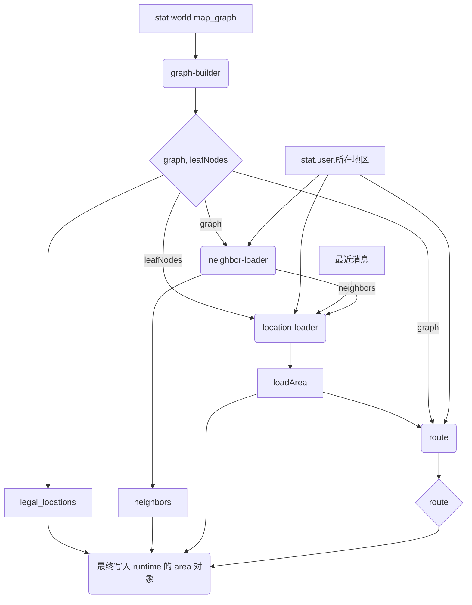

# `runtime-builder/area` 模块说明

## 1. 模块职责

本模块的核心职责是处理所有与地理、位置和路线相关的数据。它通过一系列子模块的协作，最终在 `runtime` 对象中生成关于地图、合法位置、邻近区域和可行路线的结构化信息。

该模块遵循“显式覆盖”原则，在处理开始时即为所有输出属性设置空的默认值，确保每轮计算都能完全覆盖上一轮的旧数据。

## 2. 数据流与子模块协同

`area` 模块的执行是一个清晰的、分步骤的数据处理流水线：



1. **`graph-builder`**: 作为起点，从 `stat.world.map_graph` 读取原始地图数据，构建一个标准的图邻接表 (`graph`) 和一个包含所有地点名称的列表 (`leafNodes`)。
2. **`neighbor-loader`**: 接收 `graph` 和用户当前位置 (`stat.user.所在地区`)，查询并返回所有与当前位置直接相连的邻居地点 (`neighbors`)。
3. **`location-loader`**: 这是一个核心的“兴趣点”过滤器。它接收所有合法地点 (`leafNodes`) 和邻居 (`neighbors`)，并结合用户当前位置和最近消息中提到的地点，最终确定当前场景下需要关注的“活跃地区”列表 (`loadArea`)。
4. **`route`**: 作为终点，接收 `graph`、用户当前位置和 `loadArea` 列表，使用广度优先搜索（BFS）算法计算从当前位置到每个活跃地区的最短路径，生成 `route` 信息。
5. **主入口 (`index.ts`)**: 负责按上述顺序编排和调用所有子模块，并将它们的结果 (`legal_locations`, `neighbors`, `loadArea`, `route`) 组装成一个对象，最终写入 `runtime`。

## 3. 读取的数据

### 3.1. 从 `stat` 读取

- **`stat.world.map_graph`** (`object`, 必须)
  - 描述：定义了整个地图结构，包含 `tree` 和 `edges`。
  - `tree`: 一个嵌套的对象/数组结构，其所有字符串叶子节点代表一个地点名称。
  - `edges`: 一个对象数组，每个对象形如 `{ a: '地点A', b: '地点B' }`，定义了两个地点之间的连接。
- **`stat.user.所在地区`** (`string`, 必须)
  - 描述：用户当前所在的地点名称。
- **最近的消息记录** (通过 `matchMessages` 间接读取)
  - 描述：用于从对话历史中提取提到的地点。

### 3.2. 从 `runtime` 读取

该模块在内部处理时，会将一个子模块的输出作为另一个子模块的输入，但它不依赖于上一轮 `runtime` 计算留下的 `area` 数据。

## 4. 写入的数据

模块执行成功后，会将一个包含以下字段的对象合并到 `runtime` 对象中。

- **`runtime.graph`** (`Record<string, Record<string, boolean>>`)
  - 描述：表示地图的邻接表图结构。键是地点名称，值是另一个对象，该对象的键是所有与外部键地点相邻的地点名称。
  - 示例：

        ```json
        {
          "博丽神社": { "魔法森林": true, "再思之道": true },
          "魔法森林": { "博丽神社": true, "红魔馆": true },
          "人间之里": { "再思之道": true },
          "再思之道": { "博丽神社": true, "人间之里": true },
          "红魔馆": { "魔法森林": true }
        }
        ```

- **`runtime.legal_locations`** (`string[]`)
  - 描述：从地图数据中提取的所有有效地点名称的列表。等同于 `Object.keys(runtime.graph)`。
  - 示例：`["博丽神社", "人间之里", "魔法森林", ...]`

- **`runtime.neighbors`** (`string[]`)
  - 描述：与用户当前位置直接相连的所有邻居地点的列表。
  - 示例：如果用户在“博丽神社”，可能返回 `["魔法森林", "再思之道"]`

- **`runtime.loadArea`** (`string[]`)
  - 描述：当前场景下需要关注的“活跃地区”列表。它至少包含用户当前位置、邻居以及最近消息中提到的地点。
  - 示例：`["博丽神社", "魔法森林", "再思之道", "红魔馆"]`

- **`runtime.route`** (`object`)
  - 描述：包含到所有活跃地区（不含自身）的路径信息。
  - 结构：

        ```typescript
        {
          candidates: string[]; // 等同于 loadArea
          routes: {
            destination: string; // 目标地点
            path: {
              hops: number; // 路径跳数/长度
              steps: { from: string; to: string; }[]; // 路径的每一步
            }
          }[];
        }
        ```

  - **示例**:

        ```json
        {
          "candidates": ["博丽神社", "红魔馆"],
          "routes": [
            {
              "destination": "红魔馆",
              "path": {
                "hops": 2,
                "steps": [
                  { "from": "博丽神社", "to": "魔法森林" },
                  { "from": "魔法森林", "to": "红魔馆" }
                ]
              }
            }
          ]
        }
